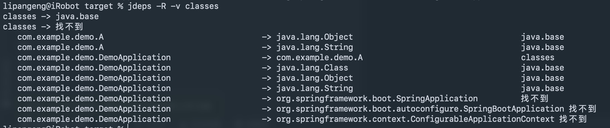
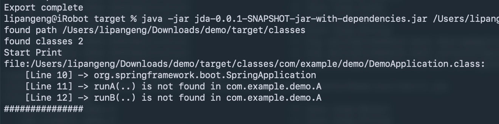
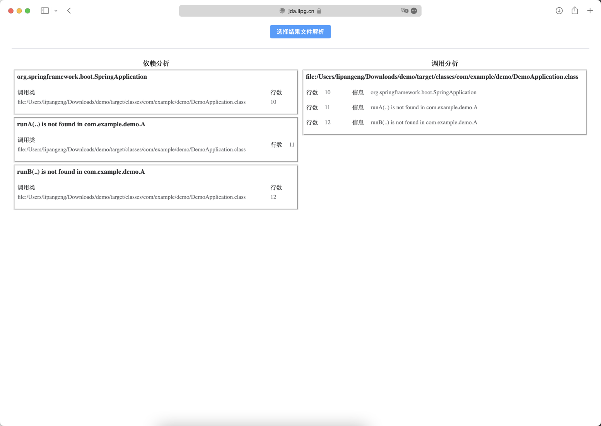

# Java-Dependence-Analysis
Java Dependence Analysis

# 前言
在Java项目项目中，经常会面临依赖升级，依赖变更的情况。通常情况下，无法做到全面的检查，java8以上版本自带的`jdeps`命令可以对依赖进行分析，但受限于JDK的版本，`jdeps`功能有一定差异，虽然可以检测到类依赖确实，但通常无法检查到方法的缺失。此工具就是为了全面的解决依赖问题，**可以提供成员变量类型、方法参数、方法返回值、方法异常捕获、字节码指令中涉及到类和方法的内容的全面检查**。
最终通过该工具与jdeps工具的配合，在对项目进行依赖升级后，可以及早的发现项目风险。比如：在处理某一依赖漏洞，只针对某一个依赖升级，关联依赖无法升级的情况。
# 命令行工具
> 使用Java8以上版本自带的`jdeps`也可以进行依赖检查，但是没有那么细致。
> 在实际使用中，可以将jdeps与该工具协同使用。
> JDA源代码地址：[https://github.com/lipangeng/Java-Dependence-Analysis](https://github.com/lipangeng/Java-Dependence-Analysis)

此工具为一个jar文件，通过java -jar的方式运行，并且将异常信息输出至控制台。
示例命令 `JDA_DEBUG=false JDA_FILTER='com.*' java -jar jda-0.0.1.jar /Users/lipangeng/Downloads/app-upload/WEB-INF/classes /Users/lipangeng/Downloads/app-upload/WEB-INF/lib/*`
`环境变量 JDA_DEBUG`：控制是否打开Debug
`环境变量 JDA_FILTER`: Java的正则控制，如果缺失的类满足该正则条件，则会在最后打印报告时打印出来，不满足的条件的一律不打印。
`环境变量 JDA_OUT`: 默认为`result.json`，会将结果输出为json文件，并且可以在可视化界面中打开该文件，进行可视化查看，可以通过https://jda.lipg.cn访问。
`命令行参数`: 为classpath，可以为class文件目录，可以为jar文件，可以以/*结尾，加载目录下全部的jar/zip。
# 运行效果
jdeps 运行效果

jda 运行效果

jda-web 运行效果
